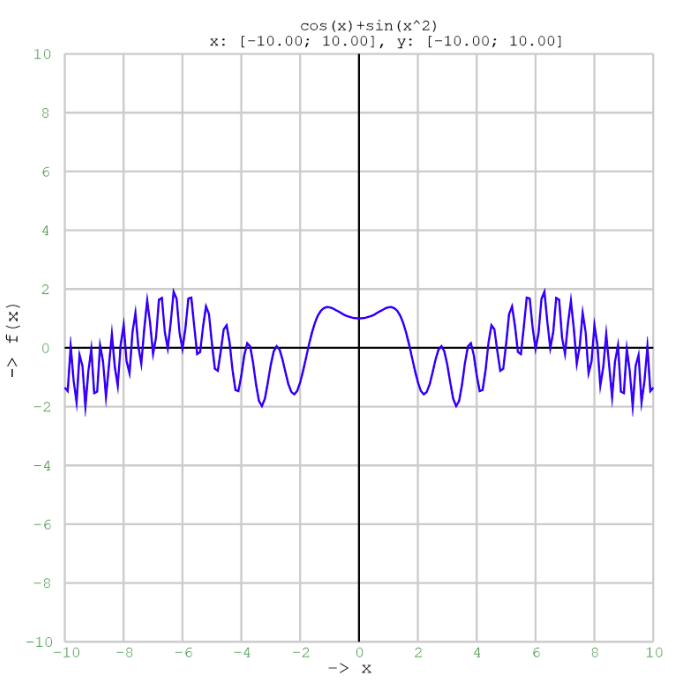

# C Graphical Calculator



## Overview

**C Graphical Calculator** is an ANSI C project that functions as a graphical calculator. It reads a mathematical function and an interval from the command line and generates a PostScript file containing the graph of the function over the specified range. If no custom limits are provided, the program defaults to using an interval of `-10` to `10` for both the `x` and `y` axes.

## Features

- **Input Validation:** Verifies the correctness of the function and file name provided via command-line arguments.
- **Graph Calculation:** Computes function values over the defined interval using a fixed step value.
- **PostScript Generation:** Produces a PostScript file that visually represents the function with clearly marked axes and grid lines.
- **Cross-Platform:** Compiled in ANSI C, ensuring portability between Windows and Linux systems.

## Requirements

- ANSI C compiler (e.g. `gcc`)
- Make utility for building the project

## Compilation

To compile the project, use the provided Makefile.

For Linux:
```bash
make
```

For Windows:
```bash
make -f makefile.win
```

The Makefile uses the project target name `SemestralWork`.

## Usage

Run the generated executable from the command line using the following syntax:

```bash
graph.exe "function" "output_file.ps" [limits]
```

Where:

- `"function"` is a mathematical function of `x` (e.g. `"sin(x)*cos(x)"`).
- `"output_file.ps"` is the name of the PostScript file to be created.
- `[limits]` is an optional parameter defining the interval in the format `x_min:x_max:y_min:y_max` (e.g. `-5:5:-10:10`).

### Examples

1. **With Custom Limits**

   ```bash
   graph.exe "x^2 - 3*x + 2" "quadratic.ps" "-5:5:-10:10"
   ```

   This command generates a graph for the function `x^2 - 3*x + 2` with `x` ranging from `-5` to `5` and `y` ranging from `-10` to `10`.

2. **With Default Limits**

   ```bash
   graph.exe "sin(x)*cos(x)" "output.ps"
   ```

   In this case, the program uses the default interval of `-10` to `10` for both axes.

## How It Works

- **Input Parsing:** The program processes command-line arguments to extract the function, output filename, and optional interval limits.
- **Function Processing:** The function is parsed and validated to ensure proper syntax and allowed characters.
- **Graph Calculation:** The program computes the function values over the specified interval using a predetermined step size.
- **PostScript Generation:** The calculated points are used to create a PostScript file that includes axes, grid lines, and labels for clear visualization of the graph.

## Notes

- The function must be provided in terms of `x` and adhere to standard mathematical notation.
- In case of insufficient or incorrectly formatted arguments, the program will display a usage message and exit with an error.

## License

This project is released under the [MIT License](LICENSE).

---

*Enjoy using **C Graphical Calculator** and feel free to contribute or report any issues!*